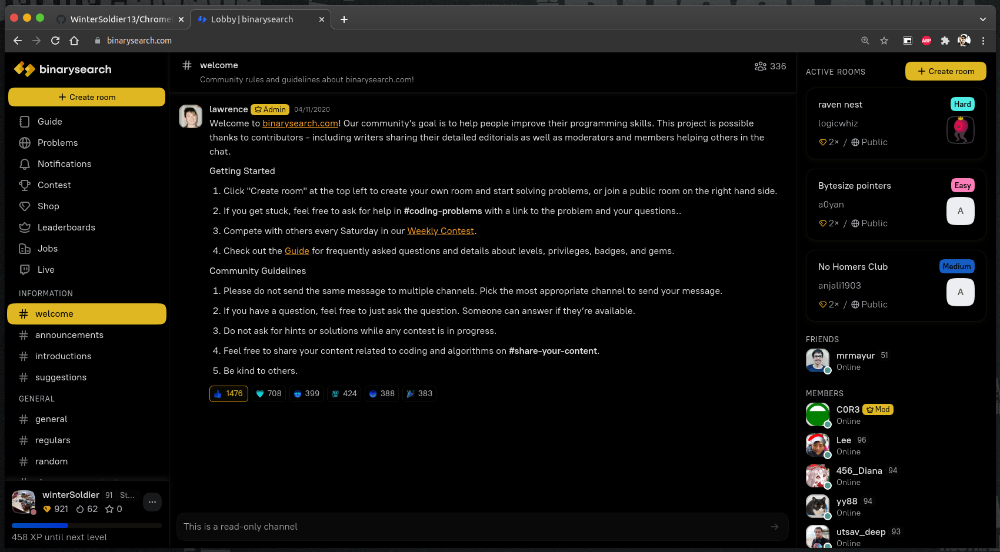
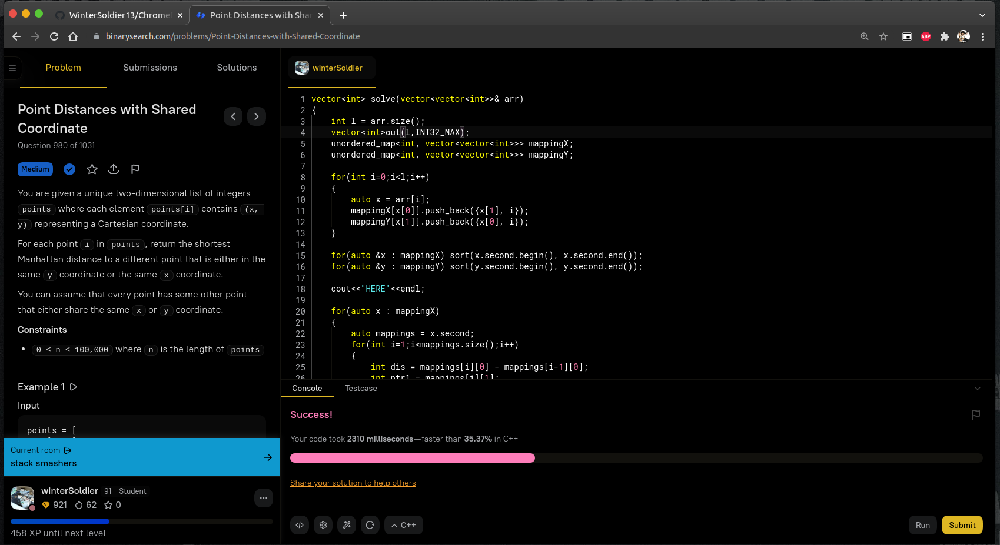

# BinarySearch.io OLED DarkMode Chrome Extension

### Screenshots

image1:

 

image2:

## How to use?
1. make sure you have your binarysearch.com account in LIGHT mode.
2. clone this repo
3. Open chrome://extensions/
4. click "Load Unpacked" and then select the repo folder. (You need to have developer mode enabled in order to do this)
5. Now everytime you open binarysearch.com or binarysearch.io, it will be turned into dark-black(OLED) mode :D.

## Known bugs
During chatting on a `#channel` the new user_images MAY appear negative.

## Contribution
Fork this repo and make a PR :)
